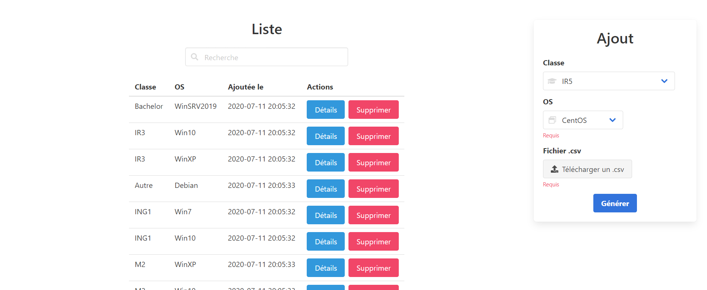

# Proxmox VE Web Interface

<p align="center">
  
</p>


Upload a simple .csv (with columns `firstname, lastname, email`) file to clone VMs from a template/VM id and affect role.
You can next delete them in one click 🐱‍🏍

All VM id are created with the next pattern :
`{class id}{os id}{001..N}`, for exemple if class is **IR4** and OS **CentOS**, the first user will have th VM id `41001`.


## Get Started 🐱‍💻
```bash
pip3 -r requirements.txt
python3.8 proxmox_multiple_clone.py # python >= 3.0 required
```

Next go to http://localhost:8080

## Mini Documentation 📚

You can change these variables:
```python
app.config["BASIC_AUTH_USERNAME"] = "admin" # login 

app.config["BASIC_AUTH_PASSWORD"] = "1234" # password

#infos proxmox
url_proxmox = "https://172.16.1.92:8006" #without / at the end
username = "balbla@pve"
password = "12345"

role = "Etudiant" # user's role on the cloned vm
authentication_mode = "authentification-AD" # user authentication method in proxmox, exemple with user peterpan: peterpan@authentification-AD
```
You can add a maximum of 2 nodes to distribute the created VMs:
```python
nodes_list = ["proxmox1"] 
# or 
nodes_list = ["proxmox1", "proxmox2"] # for exemple, you need to have the same template (with same id) in each node
```
You can edit the dictionaries below:
```json
os_equivalent = {
    "1": "CentOS",
    "2": "Debian",
    "3": "Linux_Autre",
    "4": "WinXP",
    "5": "Win7",
    "6": "Win10",
    "7": "WinSRV2016",
    "8": "WinSRV2019",
    "9": "Win_Autre",
}

template_equivalent = {
    "CentOS": 100,
    "WinSRV2016": 104,
}

class_equivalent = {
    "1": "ING1",
    "2": "ING2",
    "3": "IR3",
    "4": "IR4",
    "5": "IR5",
    "6": "Bachelor",
    "7": "M1",
    "8": "M2",
    "9": "Autre",
}
```

The **value** associated with one of the `os_equivalent` **keys** must match an equivalent `template_equivalent` **key**, ex:
```python
os_equivalent = {
    "1": "CentOS", # this value (CentOS) match with 
    "2": "Debian",
    "3": "Linux_Autre",
    "4": "WinXP",
    "5": "Win7",
    "6": "Win10",
    "7": "WinSRV2016",
    "8": "WinSRV2019",
    "9": "Win_Autre",
}

template_equivalent = {
    "CentOS": 100, # this template key (CentOS)
    "WinSRV2016": 104,
}
```
